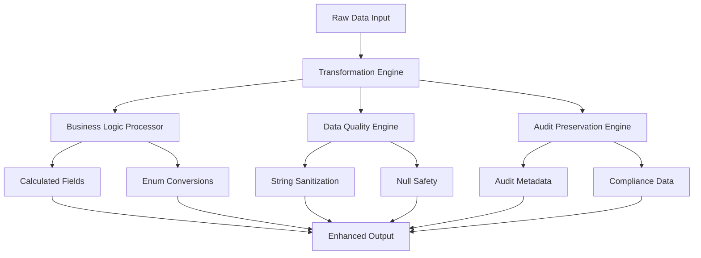

# Entity-DTO Transformation Patterns

**Version:** 1.0  
**Date:** December 19, 2024  
**Focus:** Advanced Mapping Patterns and Transformation Strategies  

## Table of Contents

1. [Transformation Pattern Overview](#transformation-pattern-overview)
2. [Bidirectional Mapping Patterns](#bidirectional-mapping-patterns)
3. [Calculated Field Patterns](#calculated-field-patterns)
4. [Data Quality Transformation Patterns](#data-quality-transformation-patterns)
5. [Audit-Aware Mapping Patterns](#audit-aware-mapping-patterns)
6. [Performance Optimization Patterns](#performance-optimization-patterns)
7. [Integration Patterns](#integration-patterns)
8. [Error Handling Patterns](#error-handling-patterns)

## Transformation Pattern Overview

The Smart Supply Pro inventory system implements **sophisticated transformation patterns** that go beyond simple field mapping to include business logic preservation, data quality assurance, and enterprise compliance support.

### Core Pattern Philosophy



## Bidirectional Mapping Patterns

### Pattern 1: Enrichment-Focused Entity-to-DTO

**Purpose**: Transform persistence entities into API-ready DTOs with calculated fields and relationship resolution.

#### Implementation Pattern
```java
public static InventoryItemDTO toDTO(InventoryItem item) {
    // Calculate total value with business logic
    BigDecimal totalValue = item.getPrice() != null && item.getQuantity() != null
        ? item.getPrice().multiply(BigDecimal.valueOf(item.getQuantity()))
        : BigDecimal.ZERO;
    
    return InventoryItemDTO.builder()
        .id(item.getId())
        .name(item.getName())
        .price(item.getPrice())
        .quantity(item.getQuantity())
        .totalValue(totalValue)  // ← Calculated field
        .supplierName(item.getSupplier() != null ? item.getSupplier().getName() : null)  // ← Relationship resolution
        .minimumQuantity(item.getMinimumQuantity())
        .createdBy(item.getCreatedBy())
        .createdAt(item.getCreatedAt())
        .build();
}
```

**Pattern Characteristics:**
- **Data Enrichment**: Adds calculated fields not present in entity
- **Relationship Flattening**: Resolves associations for client simplicity
- **Audit Preservation**: Maintains complete audit trail
- **API Optimization**: Structures data for optimal client consumption

**Use Cases:**
- REST API responses
- Frontend data binding
- Report generation
- Analytics data preparation

### Pattern 2: Sanitization-Focused DTO-to-Entity

**Purpose**: Transform client DTOs into clean entities ready for persistence operations.

#### Implementation Pattern
```java
public static InventoryItem toEntity(InventoryItemDTO dto) {
    return InventoryItem.builder()
        .id(dto.getId())  // May be overridden by service for security
        .name(dto.getName())
        .price(dto.getPrice())
        .quantity(dto.getQuantity())
        .minimumQuantity(dto.getMinimumQuantity())
        // Note: totalValue is NOT mapped (calculated field only)
        // Note: supplierName is NOT mapped (relationship handled by service)
        // Note: audit fields are NOT mapped (server-authoritative)
        .build();
}
```

**Pattern Characteristics:**
- **Data Sanitization**: Cleans input data for persistence
- **Server Authority**: Excludes server-managed fields
- **Validation Preparation**: Prepares data for validation frameworks
- **Security Focus**: Prevents client manipulation of sensitive fields

**Use Cases:**
- API request processing
- Update operations
- Data validation preparation
- Service layer input

## Calculated Field Patterns

### Pattern 1: Financial Calculation with Precision

**Business Rule**: Inventory total value = price × quantity with financial precision

#### Implementation Strategy
```java
// Financial precision calculation pattern
private static BigDecimal calculateTotalValue(BigDecimal price, Integer quantity) {
    if (price == null || quantity == null) {
        return BigDecimal.ZERO;  // Safe default for missing data
    }
    
    return price.multiply(BigDecimal.valueOf(quantity));
}

// Usage in transformation
BigDecimal totalValue = calculateTotalValue(item.getPrice(), item.getQuantity());
```

**Pattern Benefits:**
- **Financial Accuracy**: BigDecimal prevents floating-point errors
- **Null Safety**: Graceful handling of incomplete data
- **Business Logic Centralization**: Calculation logic in one place
- **Testability**: Isolated calculation method for unit testing

### Pattern 2: Real-Time Calculation During Transformation

**Strategy**: Calculate derived values only when creating DTOs, never store calculated values in entities.

#### Architecture Approach
```java
public static InventoryItemDTO toDTO(InventoryItem item) {
    // Real-time calculation during transformation
    BigDecimal totalValue = item.getPrice() != null && item.getQuantity() != null
        ? item.getPrice().multiply(BigDecimal.valueOf(item.getQuantity()))
        : BigDecimal.ZERO;
    
    return InventoryItemDTO.builder()
        .totalValue(totalValue)  // ← Calculated on-demand
        // ... other fields
        .build();
}
```

**Pattern Advantages:**
- **Data Consistency**: Always up-to-date calculated values
- **Storage Efficiency**: No redundant data in database
- **Maintenance Simplicity**: Single source of truth for calculations
- **Performance**: Calculation only when needed

## Data Quality Transformation Patterns

### Pattern 1: String Sanitization and Normalization

**Purpose**: Ensure consistent string data quality across all transformations.

#### Implementation Pattern
```java
private static String trimOrNull(String input) {
    if (input == null) {
        return null;  // Preserve null values
    }
    
    String trimmed = input.trim();
    return trimmed.isEmpty() ? null : trimmed;  // Convert empty to null
}

// Usage in entity transformation
public static Supplier toEntity(SupplierDTO dto) {
    return Supplier.builder()
        .name(trimOrNull(dto.getName()))          // ← Sanitized
        .contactName(trimOrNull(dto.getContactName()))  // ← Sanitized
        .phone(trimOrNull(dto.getPhone()))        // ← Sanitized
        .email(trimOrNull(dto.getEmail()))        // ← Sanitized
        .build();
}
```

**Quality Assurance Features:**
- **Whitespace Elimination**: Removes leading/trailing spaces
- **Empty String Normalization**: Converts empty strings to null
- **Database Optimization**: Null values improve query performance
- **Consistent Handling**: Uniform sanitization across all fields

### Pattern 2: Multi-Level Null Safety

**Purpose**: Prevent NullPointerException and handle incomplete data gracefully.

#### Implementation Strategy
```java
public static SupplierDTO toDTO(Supplier supplier) {
    // Level 1: Input validation
    if (supplier == null) {
        return null;  // Early return for null input
    }
    
    return SupplierDTO.builder()
        .id(supplier.getId())
        .name(supplier.getName())  // Level 2: Individual field null safety
        .contactName(supplier.getContactName())
        .phone(supplier.getPhone())
        .email(supplier.getEmail())
        // Level 3: Relationship null safety
        .createdBy(supplier.getCreatedBy())
        .createdAt(supplier.getCreatedAt())
        .build();
}
```

**Safety Levels:**
1. **Input Validation**: Check entire object for null
2. **Field Safety**: Individual field null handling
3. **Relationship Safety**: Safe navigation through associations
4. **Builder Safety**: Builder pattern null checking

## Audit-Aware Mapping Patterns

### Pattern 1: Complete Audit Trail Preservation

**Purpose**: Maintain full audit metadata across transformations for compliance.

#### Implementation Approach
```java
public static StockHistoryDTO toDTO(StockHistory history) {
    return StockHistoryDTO.builder()
        .id(history.getId())
        .itemId(history.getItemId())
        .change(history.getChange())
        .reason(history.getReason() != null ? history.getReason().name() : null)  // ← Enum preservation
        .createdBy(history.getCreatedBy())      // ← User attribution
        .timestamp(history.getTimestamp())      // ← Precise timing
        .priceAtChange(history.getPriceAtChange())  // ← Historical context
        .build();
}
```

**Audit Features:**
- **User Attribution**: Complete change tracking
- **Temporal Accuracy**: Precise timestamp preservation
- **Change Context**: Reason and historical data
- **Enum Transformation**: Safe conversion for external systems

### Pattern 2: Server-Authoritative Field Exclusion

**Purpose**: Protect audit integrity by excluding server-managed fields from client input.

#### Security Pattern
```java
public static Supplier toEntity(SupplierDTO dto) {
    return Supplier.builder()
        .id(dto.getId())  // May be overridden by service
        .name(trimOrNull(dto.getName()))
        .contactName(trimOrNull(dto.getContactName()))
        .phone(trimOrNull(dto.getPhone()))
        .email(trimOrNull(dto.getEmail()))
        // Intentionally EXCLUDED:
        // .createdBy() - Server sets this
        // .createdAt() - Server sets this
        // .updatedBy() - Server sets this
        // .updatedAt() - Server sets this
        .build();
}
```

**Security Benefits:**
- **Audit Integrity**: Server controls audit fields
- **Tampering Prevention**: Clients cannot manipulate timestamps
- **Compliance Support**: Ensures audit trail authenticity
- **Security Assurance**: Protects sensitive metadata

## Performance Optimization Patterns

### Pattern 1: Static Utility Design

**Purpose**: Eliminate instance creation overhead for high-throughput operations.

#### Zero-Instance Pattern
```java
public final class InventoryItemMapper {
    // Private constructor prevents instantiation
    private InventoryItemMapper() {
        throw new UnsupportedOperationException("Utility class - no instances allowed");
    }
    
    // All methods are static
    public static InventoryItemDTO toDTO(InventoryItem item) {
        // Transformation logic
    }
    
    public static InventoryItem toEntity(InventoryItemDTO dto) {
        // Transformation logic
    }
}
```

**Performance Benefits:**
- **Memory Efficiency**: No object creation overhead
- **CPU Optimization**: Direct static method calls
- **Garbage Collection**: Reduced object allocation pressure
- **Thread Safety**: Stateless design enables concurrent access

### Pattern 2: Builder Pattern Integration

**Purpose**: Optimize object creation while maintaining immutability and validation.

#### Efficient Construction Pattern
```java
return InventoryItemDTO.builder()
    .id(item.getId())
    .name(item.getName())
    .price(item.getPrice())
    .quantity(item.getQuantity())
    .totalValue(totalValue)  // Pre-calculated
    .supplierName(supplierName)  // Pre-resolved
    .minimumQuantity(item.getMinimumQuantity())
    .createdBy(item.getCreatedBy())
    .createdAt(item.getCreatedAt())
    .build();  // Single object creation
```

**Optimization Features:**
- **Single Allocation**: Builder creates one final object
- **Validation Integration**: Builder can validate during construction
- **Immutability**: Thread-safe result objects
- **Null Safety**: Builder pattern handles null checking

## Integration Patterns

### Pattern 1: Service Layer Integration

**Purpose**: Seamless integration with business logic layer through clean interfaces.

#### Service Integration Flow
```java
// Service method example
public InventoryItemDTO updateInventoryItem(Long id, InventoryItemDTO dto) {
    // 1. Transform DTO to entity (clean input)
    InventoryItem updateEntity = InventoryItemMapper.toEntity(dto);
    
    // 2. Apply business logic
    updateEntity.setId(id);  // Server-authoritative ID
    InventoryItem existingItem = repository.findById(id);
    updateEntity.setCreatedAt(existingItem.getCreatedAt());  // Preserve audit
    updateEntity.setCreatedBy(existingItem.getCreatedBy());
    
    // 3. Persist changes
    InventoryItem savedEntity = repository.save(updateEntity);
    
    // 4. Transform entity to DTO (enrich output)
    return InventoryItemMapper.toDTO(savedEntity);
}
```

**Integration Benefits:**
- **Clean Boundaries**: Clear separation between layers
- **Data Transformation**: Automatic enrichment and sanitization
- **Business Logic Focus**: Service layer focuses on business rules
- **API Consistency**: Uniform response structure

### Pattern 2: Controller Integration

**Purpose**: Direct integration with REST controllers for API operations.

#### Controller Integration Pattern
```java
@RestController
@RequestMapping("/api/inventory")
public class InventoryController {
    
    @PostMapping
    public ResponseEntity<InventoryItemDTO> createItem(@RequestBody @Valid InventoryItemDTO dto) {
        // Transform and delegate to service
        InventoryItem entity = InventoryItemMapper.toEntity(dto);
        InventoryItem created = inventoryService.createItem(entity);
        InventoryItemDTO response = InventoryItemMapper.toDTO(created);
        
        return ResponseEntity.status(HttpStatus.CREATED).body(response);
    }
    
    @GetMapping("/{id}")
    public ResponseEntity<InventoryItemDTO> getItem(@PathVariable Long id) {
        InventoryItem entity = inventoryService.findById(id);
        InventoryItemDTO dto = InventoryItemMapper.toDTO(entity);
        
        return ResponseEntity.ok(dto);
    }
}
```

## Error Handling Patterns

### Pattern 1: Graceful Null Handling

**Purpose**: Handle incomplete or null data without throwing exceptions.

#### Null Safety Strategy
```java
public static InventoryItemDTO toDTO(InventoryItem item) {
    if (item == null) {
        return null;  // Graceful null handling
    }
    
    // Safe supplier name resolution
    String supplierName = null;
    if (item.getSupplier() != null) {
        supplierName = item.getSupplier().getName();
    }
    
    // Safe total value calculation
    BigDecimal totalValue = BigDecimal.ZERO;
    if (item.getPrice() != null && item.getQuantity() != null) {
        totalValue = item.getPrice().multiply(BigDecimal.valueOf(item.getQuantity()));
    }
    
    return InventoryItemDTO.builder()
        .totalValue(totalValue)
        .supplierName(supplierName)
        // ... other fields
        .build();
}
```

### Pattern 2: Enum Conversion Error Handling

**Purpose**: Handle enum conversions with proper error propagation.

#### Safe Enum Transformation
```java
public static StockHistory toEntity(StockHistoryDTO dto) {
    if (dto == null) return null;
    
    // Safe enum conversion with potential exception
    StockChangeReason reason = null;
    if (dto.getReason() != null) {
        try {
            reason = StockChangeReason.valueOf(dto.getReason());
        } catch (IllegalArgumentException e) {
            // Let exception propagate for validation handling
            throw new IllegalArgumentException(
                "Invalid stock change reason: " + dto.getReason(), e);
        }
    }
    
    return StockHistory.builder()
        .reason(reason)
        // ... other fields
        .build();
}
```

**Error Handling Features:**
- **Input Validation**: Check for null and invalid values
- **Exception Propagation**: Allow validation frameworks to handle errors
- **Clear Error Messages**: Descriptive error information
- **Data Integrity**: Ensure only valid data reaches persistence layer

---

## Pattern Summary

The transformation patterns implemented in the Mapper layer provide:

1. **Business Logic Integration**: Calculated fields and domain rule preservation
2. **Data Quality Assurance**: Comprehensive sanitization and validation
3. **Performance Optimization**: Static utilities and efficient object creation
4. **Enterprise Compliance**: Complete audit trail preservation and security
5. **Integration Support**: Clean boundaries with service and controller layers

These patterns collectively ensure that the mapping layer serves as a robust, performant, and compliant transformation gateway for the enterprise inventory management system.

---
*This document details the advanced transformation patterns implemented in the Smart Supply Pro Mapper layer, supporting enterprise-grade entity-DTO transformation requirements.*